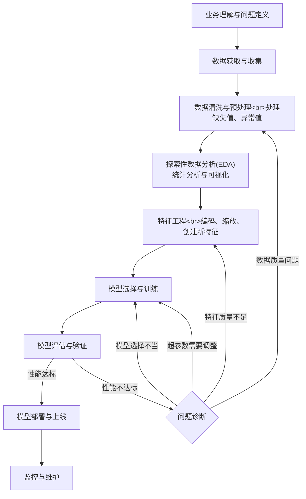

# 数据分析一般流程
以kaggle数据集“Titanic: Machine Learning from Disaster”为例

## 1. 数据获取与初步探索

### 思路

首先要把数据集加载到合适的数据结构中（比如 Python 里的 Pandas DataFrame），然后查看数据的基本信息，像数据集包含多少行和列、各个字段的数据类型是什么、有没有缺失值、重复值、明显异常值以及其分布情况。接着看看数据集前几行内容，了解数据的大致样子，例如字段里具体是什么样的数据、数据的格式等。

### 预期结果

你会清楚数据集的规模大小，知道有多少个样本（行数）和多少个特征（列数）。了解到每个特征的数据类型，是数值型（如整数、浮点数），还是文本型等。并且能发现哪些特征存在缺失值，以及缺失值的大致数量，对数据的整体面貌有初步的认识。

## 2. 探索性数据分析（EDA）

### 思路

对各个特征进行可视化展示。对于数值型特征，可以绘制直方图来查看数据的分布情况，比如年龄、票价的分布，判断是否有异常值或者偏态分布；对于分类特征，像性别、舱位等级等，可以绘制柱状图看不同类别下的数量占比。还要分析特征与目标变量（是否幸存）之间的关系，例如不同性别、不同舱位等级的幸存率有何差异，这可以通过分组统计和绘制相应的图表（如箱线图、柱状图对比等）来实现。除此之外，可以用数值特征间的相关性矩阵进行相关性分析，散点图矩阵进行多变量分析。

### 预期结果

通过可视化，直观地看到各个特征的数据分布特征。能够发现哪些特征可能对是否幸存有重要影响，比如可能会发现女性的幸存率明显高于男性，高舱位等级的乘客幸存率更高等规律，为后续的特征选择和工程提供依据。

## 3. 数据清洗

### 思路

处理在数据探查中发现的缺失值。对于数值型特征，如果缺失值较少，可以用均值、中位数填充；如果缺失值较多且有其他相关特征，可以尝试构建模型（如线性回归）来预测填充。对于分类特征，可以用出现频率最高的类别来填充。还要处理异常值，根据数据分布和业务逻辑判断哪些值属于异常，然后选择合适的方法（如截断、删除等）进行处理。

### 预期结果

得到一个没有缺失值或者缺失值得到合理处理，并且异常值也被妥善对待的数据集，让数据质量更适合后续的模型训练。

## 4. 特征工程

### 思路

对分类特征进行编码，比如将性别转换为 0 和 1，对于舱位等级、登船港口等多分类特征，可以使用独热编码。可以从现有的特征中构造新的特征，例如根据兄弟姐妹数量和父母子女数量构造家庭规模特征。对数值型特征进行标准化或归一化处理，让不同特征在数值范围上具有可比性，比如对年龄和票价进行标准化，这样有助于模型更快收敛和提高性能。

### 预期结果

生成一组经过优化和转换的特征集合，这些特征更能反映数据的内在规律，并且符合模型对输入数据的要求。

## 5. 模型选择与训练

### 思路

选择支持向量机（SVM）作为分类模型，根据前面的分析和特征工程结果准备好训练数据（特征矩阵和对应的目标变量）。将数据集划分为训练集和验证集（比如按照 80:20 的比例），然后用训练集来训练 SVM 模型，选择合适的核函数（如线性核、径向基核等）和调整超参数（如惩罚参数 C）。

### 预期结果

得到一个训练好的 SVM 模型，该模型在训练集上能够学习到特征与是否幸存之间的关系，并且在验证集上也能有一定的预测能力。

## 6. 模型评估

### 思路

使用验证集来评估训练好的模型性能，常用的评估指标有准确率（预测正确的样本占总样本的比例）、精确率（预测为正例中实际为正例的比例）、召回率（实际为正例中被预测为正例的比例）、F1 值（精确率和召回率的调和平均数）等。还可以绘制混淆矩阵，直观地看到模型在不同类别上的预测情况。

### 预期结果

得到一系列量化的评估指标数值，通过这些指标判断模型的性能好坏。例如，如果准确率较高，说明模型整体预测能力较好；如果精确率和召回率在正负例上都比较均衡且较高，说明模型在不同类别上的预测效果都不错。根据评估结果，可以决定是否需要进一步调整模型或进行更多的特征工程。

