# Matplotlib 基础入门

> 本文档介绍 Matplotlib 的基础用法，包括基本绘图、格式字符串、分类变量绘图、子图布局以及常用图表类型。

---

## 1. 快速开始

### 1.1 导入库

```python
import matplotlib.pyplot as plt
import numpy as np
```

### 1.2 绘制第一条线

```python
plt.plot([(1, 2), (3, 4), (5, 6)])
plt.xlabel("X")
plt.ylabel("Y")
plt.show()
```

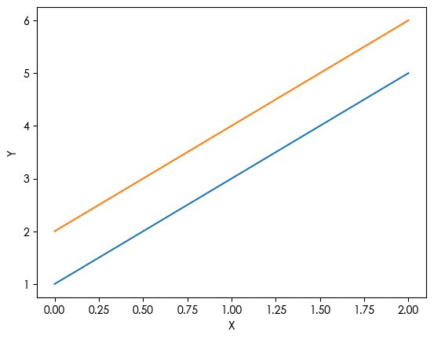

**注意**：`plot()` 接收的数据会被转置处理。列表 `[(1,2), (3,4), (5,6)]` 实际绘制成两条线：`[1,3,5]` 和 `[2,4,6]`。

---

## 2. 格式字符串（Format String）

格式字符串用于快速设置线条样式，语法为 `[颜色][线型][标记]`。

### 2.1 颜色缩写

| 缩写 | 颜色 |
|:---:|:---:|
| `r` | 红色 |
| `g` | 绿色 |
| `b` | 蓝色 |
| `k` | 黑色 |
| `y` | 黄色 |
| `m` | 品红 |
| `c` | 青色 |
| `w` | 白色 |

### 2.2 线型样式

| 符号 | 线型 |
|:---:|:---|
| `-` | 实线 |
| `--` | 虚线 |
| `-.` | 点划线 |
| `:` | 点线 |

### 2.3 标记样式

| 符号 | 标记 |
|:---:|:---|
| `o` | 圆点 |
| `s` | 方形 |
| `^` | 上三角 |
| `*` | 星号 |
| `d` | 菱形 |

### 2.4 组合示例

```python
t = np.arange(0, 5, 0.2)

# 同时绘制三条不同样式的线
plt.plot(t, t, 'r:',        # 红色点线
         t, t**2, 'b--s',   # 蓝色虚线+方形标记
         t, t**3, 'g-.^')   # 绿色点划线+三角标记
plt.show()
```

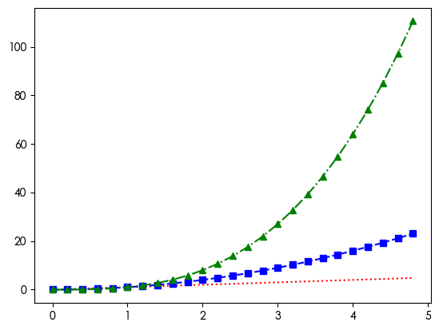

---

## 3. 坐标轴控制

```python
plt.plot([1, 2, 3, 4], [1, 4, 9, 16], 'ro')
plt.axis((0, 6, 0, 20))  # (x_min, x_max, y_min, y_max)
plt.show()
```

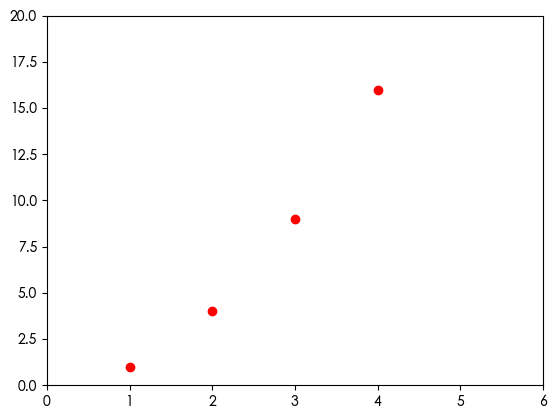

---

## 4. 分类变量绘图

当 X 轴为分类文本时，Matplotlib 提供了多种绘图函数：

```python
names = ['group_a', 'group_b', 'group_c']
values = [1, 10, 20]

plt.figure(figsize=(12, 3))

# 子图1：饼图
plt.subplot(1, 4, 1)
plt.pie(values, labels=names)

# 子图2：散点图
plt.subplot(1, 4, 2)
plt.scatter(names, values)

# 子图3：折线图
plt.subplot(1, 4, 3)
plt.plot(names, values)

# 子图4：柱状图
plt.subplot(1, 4, 4)
plt.bar(names, values)

plt.suptitle("Categorical Plotting")
plt.tight_layout()
plt.show()
```

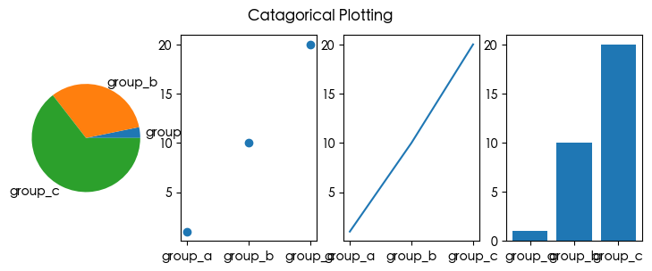

### 常用分类绘图函数

| 函数 | 说明 |
|:---|:---|
| `plt.bar(x, y)` | 垂直柱状图 |
| `plt.barh(x, y)` | 水平柱状图 |
| `plt.scatter(x, y)` | 散点图 |
| `plt.plot(x, y)` | 折线图 |
| `plt.boxplot(y, labels=x)` | 箱线图 |
| `plt.pie(y, labels=x)` | 饼图 |

---

## 5. 子图布局

### 5.1 基础子图

```python
plt.figure(figsize=(9, 6))

# 2行1列的第1个子图
plt.subplot(2, 1, 1)
plt.plot(t1, f(t1), 'bo', t2, f(t2), 'k')

# 2行1列的第2个子图
plt.subplot(2, 1, 2)
plt.plot(t2, np.cos(2*np.pi*t2), 'r--')

plt.tight_layout()
plt.show()
```

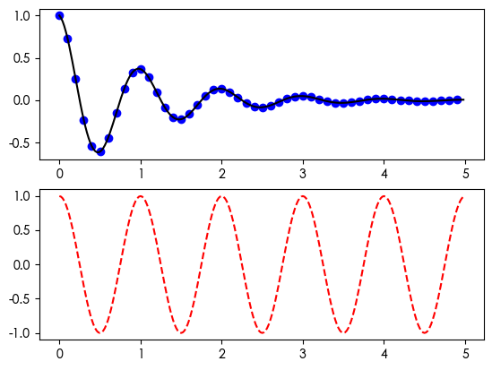

### 5.2 多画布管理

```python
# 创建/切换到画布1
plt.figure(1)
plt.suptitle('Figure 1')
plt.subplot(211)
plt.plot([1, 2, 3])
plt.subplot(212)
plt.plot([4, 5, 6])

# 创建画布2
plt.figure(2)
plt.suptitle('Figure 2')
plt.plot([4, 5, 6])

# 切回画布1，修改子图标题
plt.figure(1)
plt.subplot(211)
plt.title('Easy as 1, 2, 3')
```

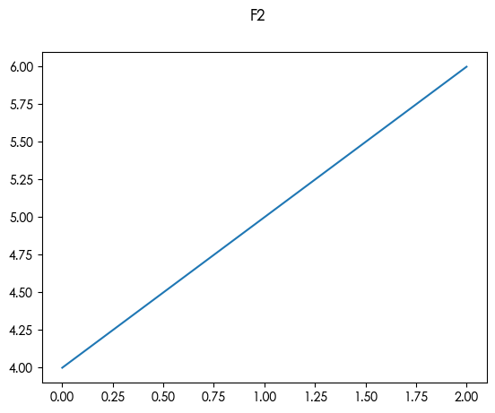

> **注意**：`plt.suptitle()` 中的 **sup** = **super**，表示整个画布的**总标题**，不是子标题。

---

## 6. 线条属性控制

### 6.1 使用 Line2D 对象

`plt.plot()` 返回的是 Line2D 对象，可以精细控制线条属性：

```python
# 解包获取 Line2D 对象（注意逗号）
line, = plt.plot(x, y, '-')

# 设置属性
line.set_antialiased(False)  # 关闭抗锯齿
line.set_marker('o')         # 添加圆点标记
line.set_linewidth(2.0)      # 线宽
line.set_color('blue')       # 颜色
```

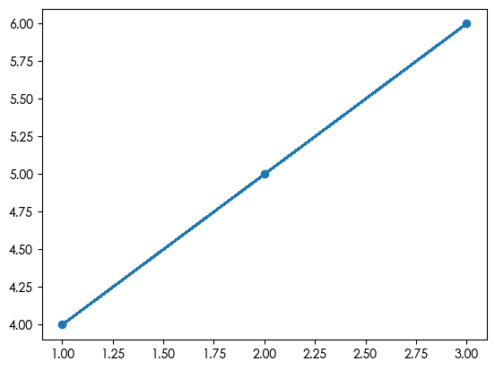

### 6.2 使用 plt.setp() 批量设置

```python
lines = plt.plot(x1, y1, x2, y2)

# 批量设置所有线条属性
plt.setp(lines, linewidth=2.0, color='b')
```

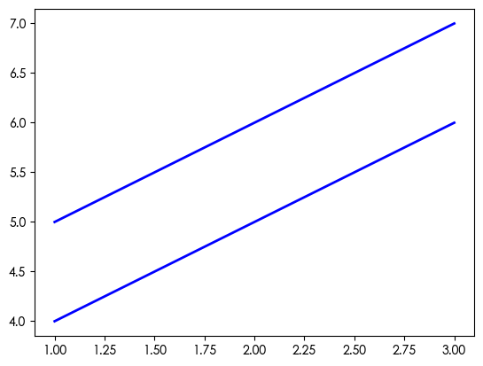

### 6.3 常用 Line2D 属性

| 属性 | 说明 | 示例值 |
|:---|:---|:---|
| `color` / `c` | 线条颜色 | `'r'`, `'#FF0000'` |
| `linestyle` / `ls` | 线型 | `'-'`, `'--'`, `'-.'`, `':'` |
| `linewidth` / `lw` | 线宽 | `1.5`, `2.0` |
| `marker` | 标记样式 | `'o'`, `'s'`, `'^'` |
| `markersize` / `ms` | 标记大小 | `5`, `10` |
| `markerfacecolor` / `mfc` | 标记填充色 | `'red'` |
| `markeredgecolor` / `mec` | 标记边框色 | `'black'` |
| `alpha` | 透明度 | `0.5` (0-1) |
| `antialiased` / `aa` | 抗锯齿 | `True`, `False` |

---

## 7. 常用图表类型

### 7.1 直方图

```python
mu, sigma = 100, 15
x = mu + sigma * np.random.randn(10000)

# density=True 表示概率密度
n, bins, patches = plt.hist(x, 50, density=True, 
                            facecolor='b', alpha=0.75)

plt.xlabel('Smarts')
plt.ylabel('Probability')
plt.title('Histogram of IQ')
plt.text(50, .025, r'$\mu=100,\ \sigma=15$')
plt.axis([40, 160, 0, 0.03])
plt.grid(True)
plt.show()
```

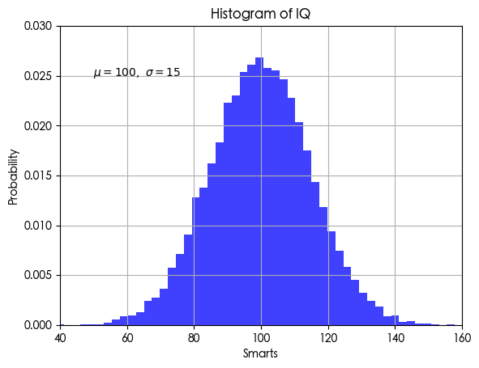

### 7.2 带注释的图表

```python
t = np.arange(0, 5, 0.01)
s = np.cos(2*np.pi*t)

line, = plt.plot(t, s, lw=2)
plt.annotate('local max', 
             xy=(2, 1),           # 箭头指向位置
             xytext=(3, 1.5),     # 文本位置
             arrowprops=dict(facecolor='b', shrink=0.1))
plt.ylim(-2, 2)
plt.show()
```

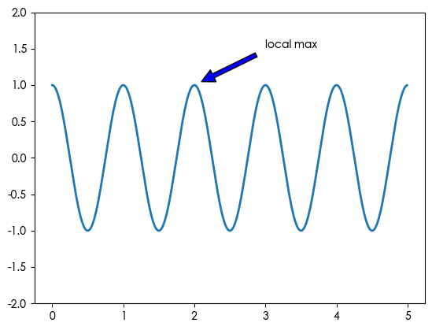

### 7.3 坐标轴缩放

```python
plt.figure()

# 线性坐标
plt.subplot(221)
plt.plot(x, y)
plt.yscale('linear')
plt.title('linear')

# 对数坐标
plt.subplot(222)
plt.plot(x, y)
plt.yscale('log')
plt.title('log')

# 对称对数
plt.subplot(223)
plt.plot(x, y - y.mean())
plt.yscale('symlog', linthresh=0.04)
plt.title('symlog')

# Logit 坐标
plt.subplot(224)
plt.plot(x, y)
plt.yscale('logit')
plt.title('logit')

plt.subplots_adjust(hspace=0.25, wspace=0.35)
plt.show()
```

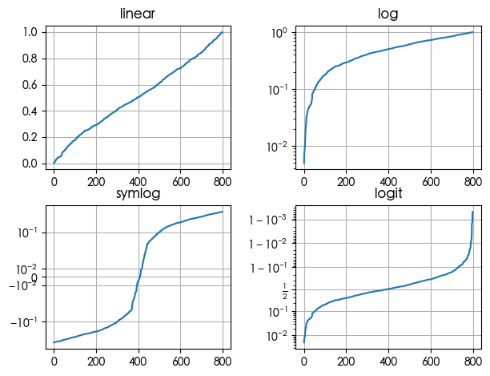

---

## 8. 最佳实践

1. **始终调用 `plt.show()`**：在脚本中显式调用以确保图表显示
2. **使用 `plt.tight_layout()`**：自动调整子图间距，避免重叠
3. **设置 `figsize`**：根据内容调整画布大小
4. **添加标签和标题**：让图表自解释
5. **保存图表**：使用 `plt.savefig('figure.png', dpi=300)` 保存高分辨率图片

---

## 参考

- [Matplotlib 官方文档](https://matplotlib.org/stable/)
- [Matplotlib Gallery](https://matplotlib.org/stable/gallery/)
