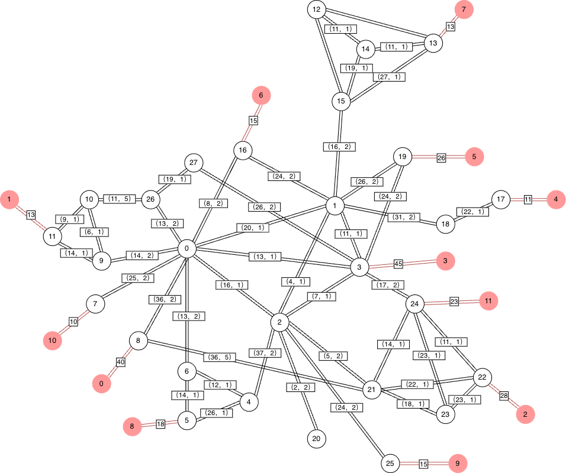

# 电信网络优化
## 题目
### 题目背景
在给定结构的电信网络中，为了将视频内容快速、低成本地传送到每个住户小区，需要在该网络结构中选择一些网络节点附近放置视频内容存储服务器。
### 已知条件
1. 每条链路有两个属性：最大带宽（BandwidthMax）、带宽使用成本（CostBandwidth）；
2. 每台服务器有两个属性：负荷能力（Capacity）、使用成本（CostService）；
3. 每个消费节点（对应住户小区）有明确的视频播放需求（Demand）。
### 约束要求
1. 每个节点最多部署一台服务器；
2. 每台服务器最多部署到一个节点上；
3. 必须满足所有住户小区的视频播放需求；
4. 中转节点的流量要平衡（接收总流量 = 发送总流量）。
### 优化目标
确定视频内容存储服务器的放置位置及需使用的带宽链路，使得：
1. 服务器使用总成本最小；
2. 链路使用总成本最小。


### 具体数据
```
普通节点数量：28
边数量：45
用户节点数量：22
服务器部署成本：100
```
#### 普通节点
| 前序节点 | 后续节点 | 最大带宽 | 每单位带宽成本 |
|----------|----------|----------|----------------|
| 0        | 16       | 8        | 2              |
| 0        | 26       | 13       | 2              |
| 0        | 9        | 14       | 2              |
| 0        | 8        | 36       | 2              |
| 0        | 7        | 25       | 2              |
| 0        | 6        | 13       | 2              |
| 0        | 1        | 20       | 1              |
| 0        | 2        | 16       | 1              |
| 0        | 3        | 13       | 1              |
| 1        | 19       | 26       | 2              |
| 1        | 18       | 31       | 2              |
| 1        | 16       | 24       | 2              |
| 1        | 15       | 16       | 2              |
| 1        | 2        | 4        | 1              |
| 1        | 3        | 11       | 1              |
| 2        | 4        | 37       | 2              |
| 2        | 25       | 24       | 2              |
| 2        | 21       | 5        | 2              |
| 2        | 20       | 2        | 2              |
| 2        | 3        | 7        | 1              |
| 3        | 19       | 24       | 2              |
| 3        | 24       | 17       | 2              |
| 3        | 27       | 26       | 2              |
| 4        | 5        | 26       | 1              |
| 4        | 6        | 12       | 1              |
| 5        | 6        | 14       | 1              |
| 8        | 21       | 36       | 5              |
| 9        | 10       | 6        | 1              |
| 9        | 11       | 14       | 1              |
| 10       | 26       | 11       | 5              |
| 10       | 11       | 9        | 1              |
| 12       | 13       | 15       | 1              |
| 12       | 14       | 9        | 1              |
| 12       | 15       | 12       | 1              |
| 13       | 14       | 11       | 1              |
| 13       | 15       | 27       | 1              |
| 14       | 15       | 19       | 1              |
| 17       | 18       | 22       | 1              |
| 21       | 22       | 22       | 1              |
| 21       | 23       | 18       | 1              |
| 21       | 24       | 14       | 1              |
| 22       | 23       | 23       | 1              |
| 22       | 24       | 11       | 1              |
| 23       | 24       | 23       | 1              |
| 26       | 27       | 19       | 1              |
#### 用户节点
| 用户节点 | 前序节点 | 节点宽带需求量 |
|----------|----------|----------------|
| 0        | 8        | 40             |
| 1        | 11       | 13             |
| 2        | 22       | 28             |
| 3        | 3        | 45             |
| 4        | 17       | 11             |
| 5        | 19       | 26             |
| 6        | 16       | 15             |
| 7        | 13       | 13             |
| 8        | 5        | 18             |
| 9        | 25       | 15             |
| 10       | 7        | 10             |
| 11       | 24       | 23             |